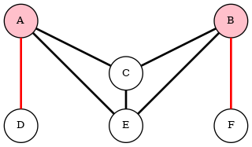

# ICFP2021
For an overview of this year's ICFP Programming Contest, see its [home page](https://icfpcontest2021.github.io/), or the [final rules specification](https://icfpcontest2021.github.io/spec-v2.0.pdf).

I was participated solo this year. Large teams can make far more progress, but I've found that going solo is more challenging, and is a better learning experience.

Many team used GUI tools and manually tweaked the poses to get answers. Some used a spring-like gradient-descent-based approach with a very complicated cost function. Some used SMT solvers. I used an automated process that iteratively applied different transformation in an attempt to find solutions. If I had another day, I would add a gradient-descent-based transformation.

At the beginning of 72-hour period, I was consistently using numpy arrays, and wondering if the problem would lend itself to CUDA. After a while, I found myself less and less with consistent typing. That was when I started using mypy to prevent the typing from getting out of hand. I also let some sections of code repetitive. Some time spent later can tidy them up.

## Rough Strategy
* Collect data on proximity of vertices and edges to the boundary of the hole.
  * E.g., for vertices, compute the distances and directions ("**proximity field**") from each vertex to the closest point on the hole boundary. And, of course, track which vertices are inside vs outside the boundary.
  * Track similar info for edges.
* Divide figure into different types of regions:
  * Regions that can be rotated around a cut point. We'll call these "**rotation components**".
  * Regions that can be reflected across a line defined by two vertices. We'll call such a line a "**crease**". This can be an edge, or a line connecting two points. In either case, a pair of vertices (which might or might not be connected by an edge) remain fixed by the reflection. We'll call these "**flip components**". (The term "fold" is semantically blocked, and "flip" lends itself better to short identifiers than does "reflection".)
* Iterate approximate of best values for:
  * (a) rotation of rotation components
  * (b) reflections of flip components
  * (c) figure translation
  * (d) squash & stretch
* Use proximity info:
  * Possibly aggregate this info up to the cut components.
    * Edges: 
      * Compute info on proximity of figure edges to the hole boundary, and find crossings.
* Visualize, visualize, visualize.
* Iterate, iterate, iterate.

## Rotatable and Flippable Regions
* Consider this figure: .
  * The cut points in the graph, A and B, are shaded pink. They divide the graph into three regions, which I'll call R-D (which includes the edge AD), R-F (which includes the edge BF), and the remaining region, R-ABCE. Regions R-D and R-F can freely rotate around their respective cut points, but region R-ABCE cannot, because it is anchored at both of those cut points.
  How can we determine which edges form "**creases**" that allow one side of the crease to be "flipped" across it?
  The edge CE forms such a crease. But if there were an edge from A to B, then CE would no longer be a crease.
  There is a notion of a "**cut edge**", which is similar to a cut point.
  * **Definition:** A **cut edge** is an edge that, when removed from a graph, increases the number of connected components in the graph.
  * Unfortunately, this isn't the notion we want.
  Half of the figure can be flipped across the CE edge, even thought it's not a cut edge.
  Let's come up with a different notion.
  * **Definition:** Let's used the term "**capped edge**" to refer to an edge, together with its two endpoints.
  * If we remove the capped edge CE, then the remaining graph does have one more connected component than it started with.
  So we see that a region on one side of a "**cut capped edge**" is a "**flip component**".
  But that's not the only type of flip component. We can also flip the portion of the diagram between vertices A and B. So we also see that the line connecting the only two cut points of a region is a "**cut capped edge**", and on each side is a "**flip component**".
